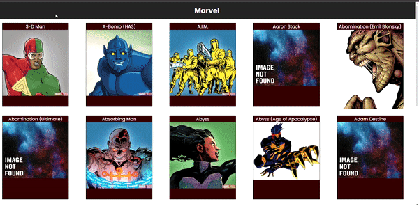

<h1 align="center">
  Marvel
</h1>

- - -

<h1>Preview</h1>

  

 

## Tecnologias

 Esse projeto foi desenvolvido com as seguintes tecnologias:

- HTML
- STYLED COMPONENTS
- REACT 
- TYPESCRIPT

## Projeto

 Nesse projeto estou consumindo a API da Marvel, onde pode ser encontrado no site [clique aqui](https://developer.marvel.com/). E depois rendenrizo em tela as cartas com o nome e a imagem do personagem que é retornada da API.

 - - - 

 Projeto desenvolvido por Enan Dorta.